# HERON

**Turns an ordinary photograph into an image that looks captured by an
instrument that sees beyond human vision** — a thermal camera, an X-ray
fluoroscope, a Kirlian plate, a night-vision tube. Not a color filter: a
physics engine. It estimates what's really in the frame (skin, hair, fabric,
metal, glass), removes the photograph's lighting, and re-synthesizes the image
from what things **are**, not from how they happened to be lit.

> Outputs are **artistic simulation** — not real thermography, medical imaging,
> or measurement. No feature, name, or doc in this project claims otherwise;
> the X-ray "skeleton" is stylized-anatomical, never diagnostic.

<p align="center">
  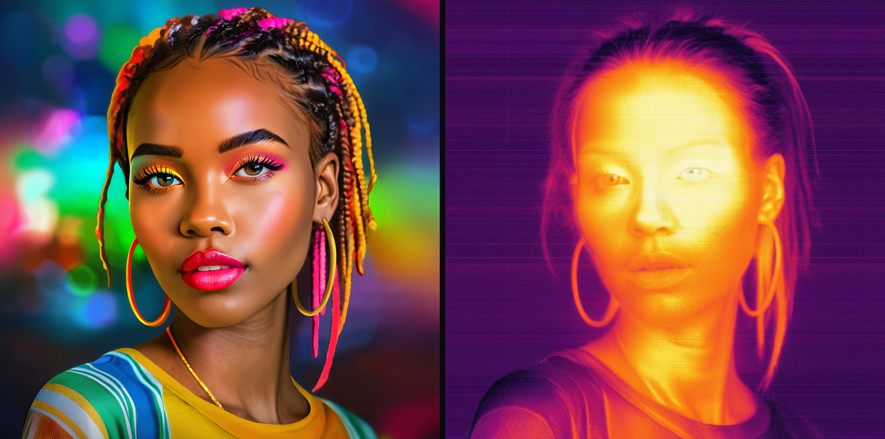
  <br><sub>Source (multi-directional stage lighting) → Heron thermograph. The colored light is gone — what's left is <em>synthesized internal emission</em>, the one thing a gradient-map filter cannot do.</sub>
</p>

---

## Why "Heron"

Named for **Heron of Alexandria** (Ἥρων, first century AD), the Greek engineer
who built the aeolipile — a sphere spun by its own steam jets, the earliest
recorded steam engine — along with automata, a mechanical theatre, and a
coin-operated dispenser that is usually called the first vending machine.

Two things about him make the name fit. First, he built **instruments that
extended the senses**: the dioptra, his sighting instrument, let a surveyor
measure angles and distances no unaided eye could judge. That is this project's
whole premise — instruments that see what human vision cannot. Second, in his
*Catoptrica* he studied mirrors and reflection and argued that light takes the
shortest path, the earliest surviving statement of a least-path principle in
optics, anticipating Fermat by sixteen centuries. Heron the program is built the
same way round: it starts from how light and heat actually behave, and derives
the picture from that rather than painting the effect on top.

And his automata existed to produce **wonder** — temple doors that opened by
themselves, birds that sang. Rigorous mechanism in the service of spectacle,
not measurement. That is exactly the bargain here: real physics, no claim to
being an instrument of record.

---

## Quick start

```bash
git clone https://github.com/tsevis/heron.git && cd heron
python3 -m venv .venv && .venv/bin/pip install -e . && .venv/bin/pip install -r requirements-ai.txt
./heron.sh
```

On first run Heron checks for the optional Layer A models (real depth, a clean
subject matte, and SAM 3 for per-region materials) and offers to fetch them. **Say no and it
still works** — the classical path needs no models at all, it is just coarser at
finding the subject. Grab them later with `python scripts/fetch_models.py`, or
point `HERON_MODELS` at copies you already have. See [MODELS.md](MODELS.md).

The engine itself never downloads anything mid-render: loaders are
`local_files_only`, because an offline deterministic engine that reaches for the
network is neither.

`heron.sh` starts the local web app and opens your browser automatically —
that's the whole setup. (`Heron.command` does the same by double-click in
Finder.) Drop a photo in, pick an instrument, turn the dials.

Prefer the command line? See [CLI usage](#cli-usage) below.

---

## The instrument rack

Eight physically-distinct engines, one shared pipeline. Pick an instrument the
way you'd pick a piece of lab equipment — each has its own physical dials and
preset shelf, but all of them share the same scene understanding, the same
Oklab palette engine, and the same sensor/optics layer underneath.

<p align="center">
  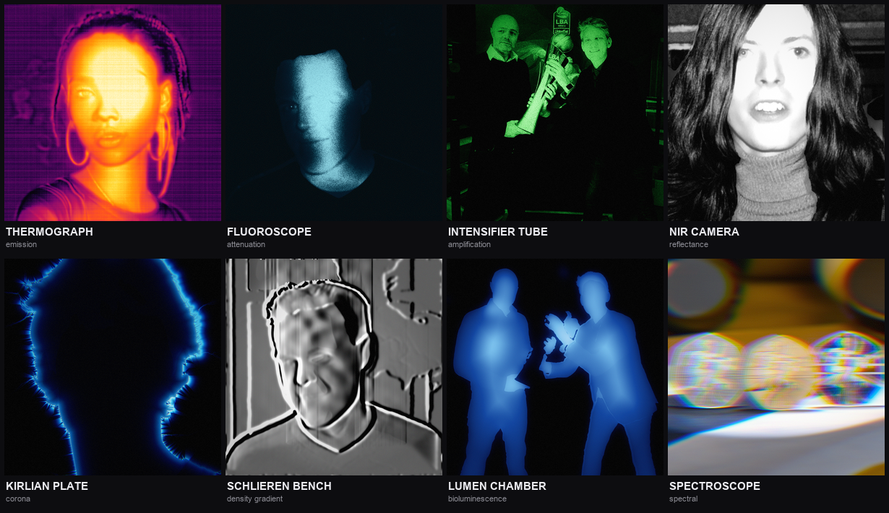
</p>

| Instrument | Physics | What it's good at |
|---|---|---|
| **Thermograph** | emission (temperature field) | portraits — the flagship, hair/skin/fabric each hold their own heat |
| **Fluoroscope** | attenuation (Beer–Lambert) | luminous translucent bodies, stylized skeletal core |
| **Intensifier Tube** | amplification (photon/Poisson) | night vision — phosphor grain, halos, honeycomb faceplate |
| **NIR Camera** | reflectance (material-driven) | foliage bursts white/red (the Wood effect), waxy skin |
| **Kirlian Plate** | synthetic corona growth | aura + dielectric-breakdown streamers from hair/fingertips |
| **Schlieren Bench** | density gradient | knife-edge relief, rising heat plumes |
| **Lumen Chamber** | bioluminescent emission | translucent glow, subsurface scatter into darkness |
| **Spectroscope** | spectral decomposition | prism dispersion, diffraction-grating smear |

One more look, because it's the clearest proof the physics is material-aware
and not just a palette swap — the same NIR engine, run with materials on:

<p align="center">
  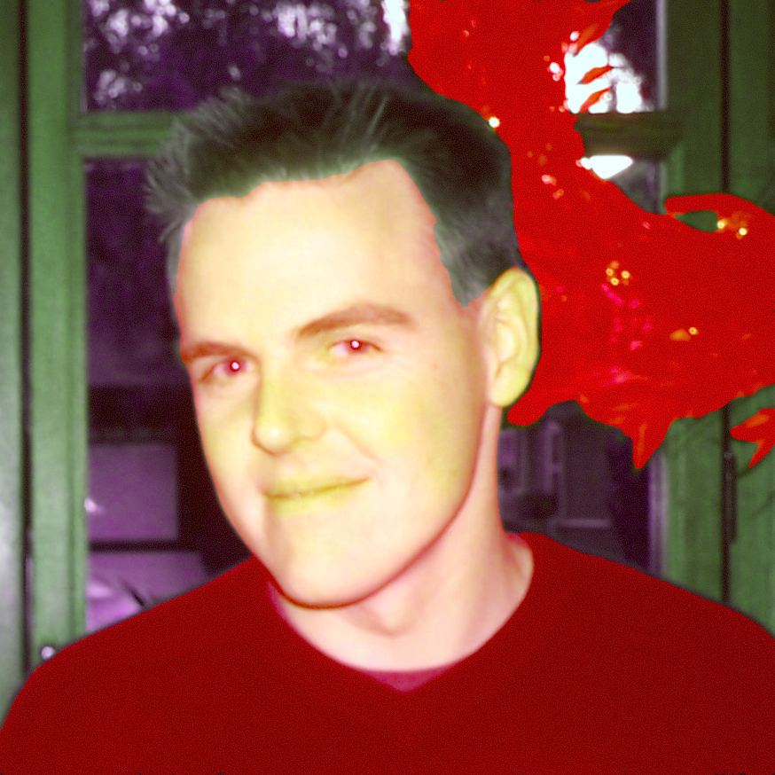
  <br><sub>NIR Camera, Aerochrome preset — chlorophyll in the plant behind him reads bright red (the real Wood effect), because Heron knows it's <em>foliage</em>, not because it's bright in the photo.</sub>
</p>

---

## Palette library

16 palette ramps, interpolated in **Oklab** so lightness climbs monotonically
and no ramp introduces a false dark band mid-scale. Below: each camera against
every ramp, same photo, same seed. Rebuild any of these with
`python scripts/palette_strips.py`.

<p align="center">
  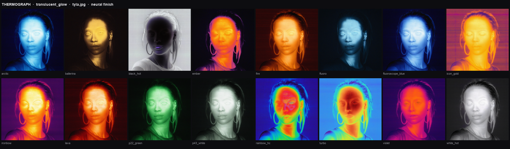
  <br><sub><b>Thermograph</b> — <code>ironbow</code>, <code>rainbow_hc</code> and <code>turbo</code> are the authentic FLIR display ramps; <code>black_hot</code> inverts to a negative.</sub>
</p>

<p align="center">
  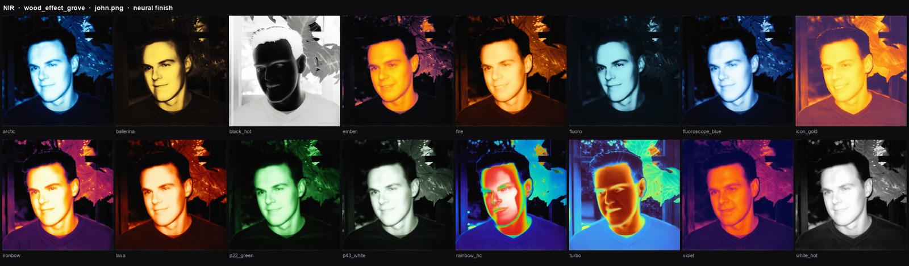
  <br><sub><b>NIR Camera</b> — the foliage stays bright in <em>every</em> ramp, including the dark ones where his face falls away. That is the Wood effect coming from the material table, not from the palette.</sub>
</p>

<details>
<summary><b>The other six cameras</b> (click to expand)</summary>

<p align="center">
  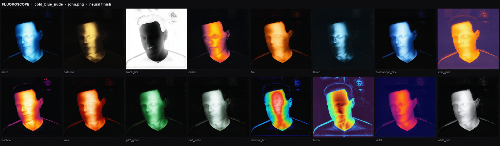
  <br><sub><b>Fluoroscope</b> — true blacks and facial structure in all 16, none blown out: the engine applies a radiographic window/level and reserves headroom below 1.0 so the phosphor bloom has somewhere to go instead of clipping.</sub>
</p>

<p align="center">
  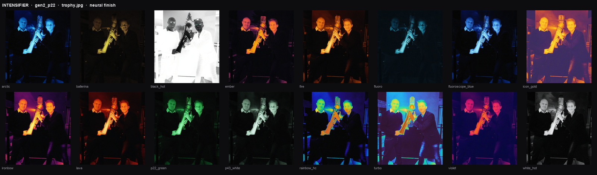
  <br><sub><b>Intensifier Tube</b> — <code>p22_green</code> is the real phosphor. This engine amplifies the source's <em>reflected</em> light, so dark clothing stays dark while the gold trophy dominates.</sub>
</p>

<p align="center">
  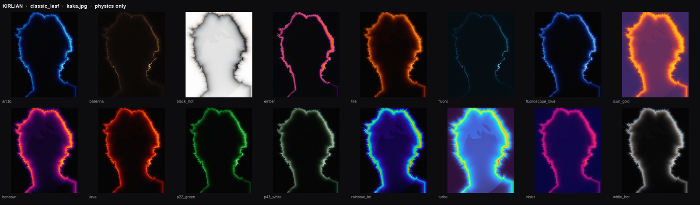
  <br><sub><b>Kirlian Plate</b> — physics only, deliberately: with the neural finisher on, the network invented facial detail under the corona that the physics never produced. Streamers ignite along the hair fringe because the material table gives hair <code>kirlian_activity: 0.9</code>.</sub>
</p>

<p align="center">
  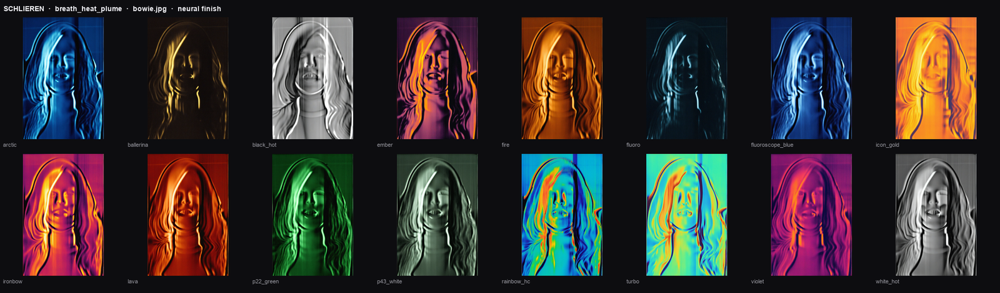
  <br><sub><b>Schlieren Bench</b> — the most palette-robust of the eight. It outputs a <em>signed</em> derivative where mid-grey means "no density gradient", so the ramp's midpoint carries the image and even weak ramps stay legible.</sub>
</p>

<p align="center">
  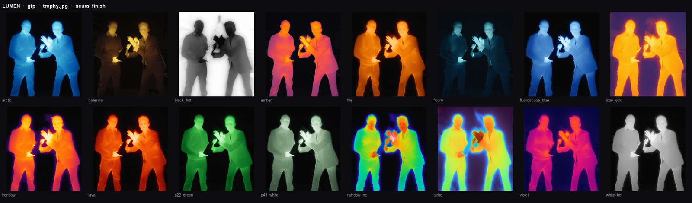
  <br><sub><b>Lumen Chamber</b> — the inverse of the intensifier on the same photo: bodies glow from within, the metal trophy goes dark.</sub>
</p>

<p align="center">
  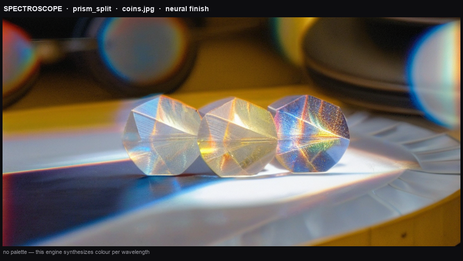
  <br><sub><b>Spectroscope</b> — one frame, not sixteen: this engine synthesizes colour per wavelength and never touches the 1-D ramp, so a palette sweep would produce sixteen identical images.</sub>
</p>

</details>

Not every pairing works, and the strips are meant to show that: `ballerina` and
`fluoro` put their dark end where most mid-tones land, so they come out nearly
black on six of the seven cameras that use a ramp at all — Schlieren being the
exception, for the reason above.

---

## Physics → neural finish (optional, hybrid look)

The procedural physics engine gets the *temperature field, geometry, and
materials* right — that's the deterministic core, and it works fully offline
with zero AI dependencies (`--no-ai`). For the closest match to a real
microbolometer capture, an optional finishing pass runs the physics render
back through a local depth-conditioned diffusion model (SDXL, or any
self-contained checkpoint you already have in ComfyUI) so the fine sensor
texture — individual hair strands, skin grain — reads as photographed rather
than painted. The physics field is always the control signal; the network
adds texture, it never invents geometry.

This is entirely optional and entirely local — see [Neural finishers](#neural-finishers-optional) below.

---

## Architecture — a fixed 4-layer stack

Every Instrument above is a **YAML configuration** of these four layers, never
a separate codebase — that's what let eight physically different engines ship
without eight rewrites of the sensor/optics/palette code.

| Layer | Package | Role |
|---|---|---|
| **A · Scene Understanding** | `heron/scene` | depth, normals, matte, de-lit albedo, saliency, materials → the **Radiance Graph** (cached per photo) |
| **B · Physics** | `heron/physics` | the per-instrument signal field — emission, attenuation, amplification, reflectance, corona, density-gradient, biolum, spectral |
| **C · Sensor & Optics** | `heron/sensor` | bloom, FPN + NETD noise, AGC, MSX edges, hex faceplate, scanlines, chromatic aberration, palette (Oklab) |
| **D · Art Direction** | `heron/art` | saliency emphasis, structure-tensor directional bloom, Poisson detail fusion (`materiality` slider) |

The engine (`heron/`) is UI-agnostic and 32-bit-float / linear-light
throughout. Layer A — the AI part (depth, matting, SAM 3 materials) — is
**always skippable**; every instrument still produces a sane result with
`--no-ai`.

<details>
<summary><b>Why de-lighting matters (the one-paragraph thesis)</b></summary>

<br>A photograph's brightness encodes *external illumination* — a face lit
from the left stays bright on the left. A real thermogram encodes *internal
emission* — a face is warm symmetrically, hottest at the tear ducts and ears,
coolest at the nose tip, regardless of which way the room light was pointed.
Heron estimates and removes the photograph's lighting, then rebuilds warmth
from a material-aware temperature field instead. That's the whole difference
between Heron and a gradient-map Instagram filter, and it's why the hero image
above has no trace of the disco lighting it started with.
</details>

---

## CLI usage

```bash
# render a thermogram — classical path, no AI models needed
python cli.py render photo.jpg -i thermograph -p flir_field -o out.png --no-ai

# the inner-glow presets
python cli.py render photo.jpg -p ember_glow      -o ember.png --no-ai
python cli.py render photo.jpg -p violet_embrace  -o violet.png --no-ai

# any other instrument
python cli.py render photo.jpg -i fluoroscope -p cold_blue_nude -o xray.png --ai
python cli.py render photo.jpg -i kirlian -p fingertip_storm -o corona.png --ai

# physical dial overrides + reproducible noise + graph dump
python cli.py render photo.jpg -s layerC.netd_mk=25 -s layerB.core_c=36 --seed 7 --dump-graph

# inspect the Radiance Graph, palettes, local model registry
python cli.py graph photo.jpg --out-dir channels/
python cli.py palette list
python scripts/smoke_models.py
```

32 presets across 8 instruments — run `python cli.py render --help` or open
the web app's preset dropdown to see them with descriptions.

---

## Web app — the Optical Bench

```bash
./heron.sh                     # starts the server, opens the browser
./heron.sh --port=8090         # use another port
```

<p align="center">
  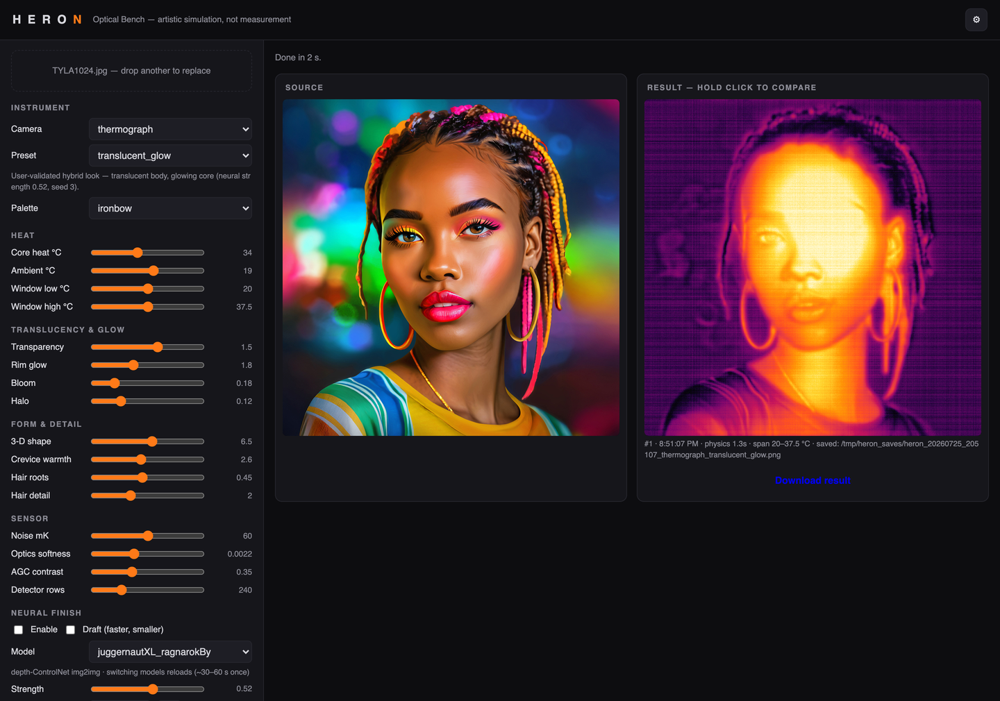
  <br><sub>Drop a photo, pick a camera, turn the dials. Every result is stamped with a render number, wall-clock time, and the Kelvin span it used.</sub>
</p>

Drop a photo, pick a **Camera** (all 8 instruments, each with its own dial
set), turn the physical dials — heat window, transparency, rim glow, 3-D
shape, hair detail, sensor noise, palette — and render. Real progress bar
(the neural stage reports actual diffusion steps, not a spinner). Hold-click
the result to A/B against the source.

Each camera exposes its *own* physics, not a shared set of sliders:

<p align="center">
  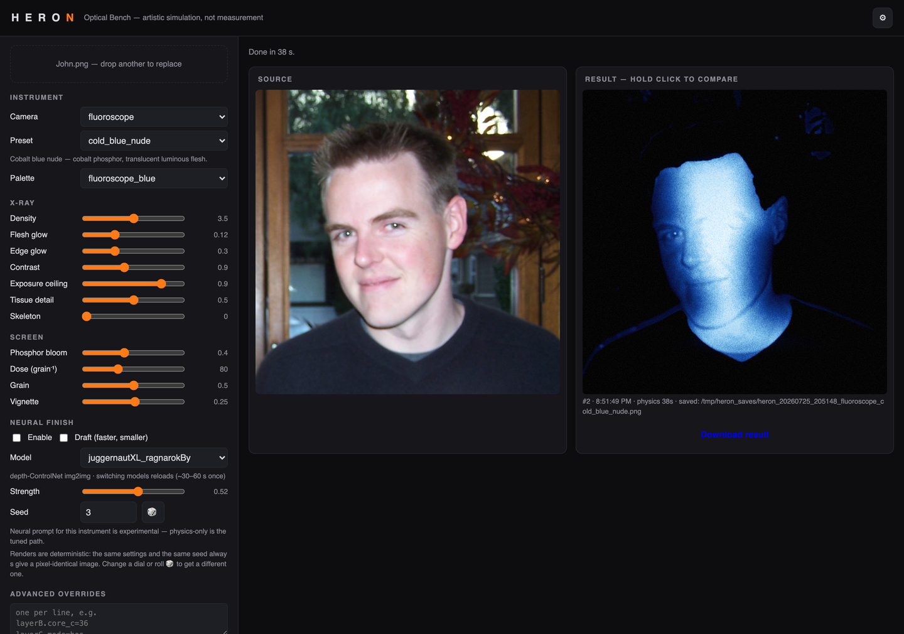
  <br><sub>Switch to the fluoroscope and the panel becomes X-ray controls — density, flesh glow, exposure ceiling, tissue detail, skeleton — over a phosphor-screen section.</sub>
</p>

The **⚙ settings** menu holds a save folder with a native macOS **Browse…**
picker (possible only because the server is local), 8/16-bit output, working
resolution, and neural/draft defaults:

<p align="center">
  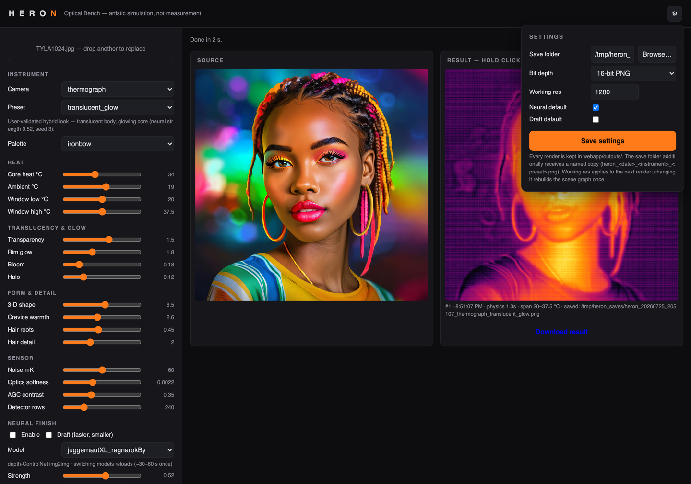
</p>

First render of a new photo builds its scene graph once (~40 s: depth, matte,
SAM 3 materials). After that, physics re-renders in a couple of seconds —
turn a dial, see the result, no AI reload. Renders are deterministic: same
settings and same seed give a pixel-identical image, so the render stamp is
how you tell a fresh result from the previous one.

---

## Photoshop panel

A UXP panel that applies any instrument to the active document and returns an
**editable layer group** rather than a flat image: the composite on top, and
every physics stage (`emission`, `processed_signal`, `temperature_c`, …) plus
the Radiance Graph channels (`depth`, `matte`, `materials`, …) as separate
hidden layers underneath, each with a sensible blend mode. Unhide any of them
and keep working.

<p align="center">
  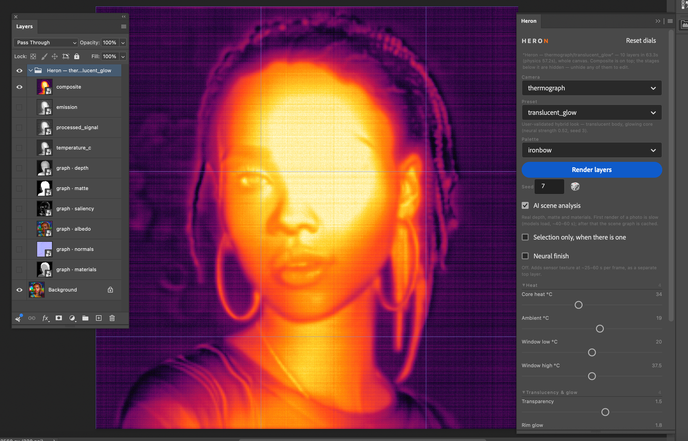
  <br><sub>One render, eleven layers. The composite sits on top; <code>emission</code>, <code>processed_signal</code> and <code>temperature_c</code> are the physics stages, and <code>graph · depth/matte/saliency/albedo/normals/materials</code> are the scene channels — all hidden, all editable. Nothing is flattened.</sub>
</p>

```bash
sudo ln -s "$PWD/uxp" "/Applications/Adobe Photoshop 2026/Plug-ins/heron"
```

Restart Photoshop → **Plugins → Heron**. It talks HTTP to the local service and
imports nothing from the engine; the dial map is served from `/api/meta`, so the
panel and the web app cannot drift apart. With a selection active it renders only
the marquee and puts the layers back on exactly those bounds — the reason the
panel beats the web app for retouching. The optional neural finish arrives as its
own top layer, never merged into the group, because a diffusion output cannot be
decomposed back into emission/noise/palette.

See [`uxp/README.md`](uxp/README.md) for install detail and the UXP gotchas.

---

## Neural finishers (optional)

Post-passes over Heron's physical output, in `neural/` — deliberately
**outside** the engine, so `heron/` itself never imports them and stays
deterministic and offline. The app's Model dropdown lists every self-contained
checkpoint it finds in your local ComfyUI install and is honest about which
ones it can actually run:

| Module | What it does |
|---|---|
| `neural/controlnet_finisher.py` | SDXL + depth-ControlNet img2img, driving local checkpoints directly via diffusers |
| `neural/zimage.py` | Z-Image Turbo, assembled entirely from on-disk components (transformer + text encoder + VAE) — no model download |
| `neural/style_transfer.py` | Gatys/AdaIN neural style transfer, with semantic region masking |
| `neural/cyclegan.py` / `neural/pix2pixhd.py` | unpaired/paired RGB↔thermal GAN architectures — built and tested, but **untrained**: they need a real thermal-image dataset (`neural/datasets.py` points at KAIST/FLIR-ADAS) before they produce anything |

```bash
python -m neural.run controlnet render.png photo.jpg --out finished.png
python -m neural.run datasets            # where to get real thermal training data
```

---

## Testing

```bash
.venv/bin/python -m pytest -q          # 185 tests
```

The **all-techniques matrix** (`tests/test_all_instruments.py`) is the
regression net for the whole rack: it renders every instrument × every preset
end-to-end and asserts each is valid, non-degenerate, seed-deterministic, and
free of AI dependencies on the classical path.

```bash
python scripts/contact_sheet.py photo.jpg --out contact.png   # visual regression, all techniques on one photo
python scripts/acceptance_sheet.py                            # source | physics | hybrid
python scripts/render_gallery.py                              # rebuilds the images used in this README
python scripts/palette_strips.py                              # every camera x every palette (resumable)
python scripts/palette_strips.py --no-neural --only kirlian    # one camera, physics only, ~16 s
```

---

## Project status

Working and in use: the eight-instrument engine, the CLI, the web app, and the
Photoshop panel. 319 tests pass.

| | |
|---|---|
| **Engine** | 8 instruments, 40 presets, one shared 4-layer stack |
| **Resolution** | full-resolution physics — a 20 MP thermogram renders in ~30 s |
| **Video** | `heron render-video`, temporally stabilised |
| **Photoshop** | layered output, selection masking, document-resolution rendering |
| **Presets** | self-contained, shareable, bit-exact on another machine |

**Known limits, stated plainly:**

- **Scene understanding runs at 1280 px** and is lifted edge-aware to the render
  resolution. This is a design decision, not a shortfall — depth, matte and
  materials are smooth semantic fields, and their models do not scale. Physics,
  sensor and art direction do run at full resolution.
- **Video is an offline render**, ~0.44 fps at 1080p. The output is stable
  (frame-to-frame noise drops from 17.5/255 to 3.9/255 against a naive per-frame
  render), but per-frame physics is 81% of the budget and its profile is flat, so
  real-time would need a GPU port rather than tuning.
- **The GAN finishers are architecture-only.** `neural/cyclegan.py` and
  `neural/pix2pixhd.py` are built and untrained; there is no thermal training
  data on disk. The SDXL/Z-Image img2img finishers are the working path.
- **The ComfyUI adapter is unused** — ComfyUI does not start on the development
  machine, and repairing someone else's install is out of scope.

## Do not

Do not treat any Heron output as real thermography, medical imaging, or
measurement. This project does not add cloud API calls to the engine, does
not commit model weights, and does not touch other projects' model folders
except read-only.

## License

[MIT](LICENSE) © 2026 Charis Tsevis
